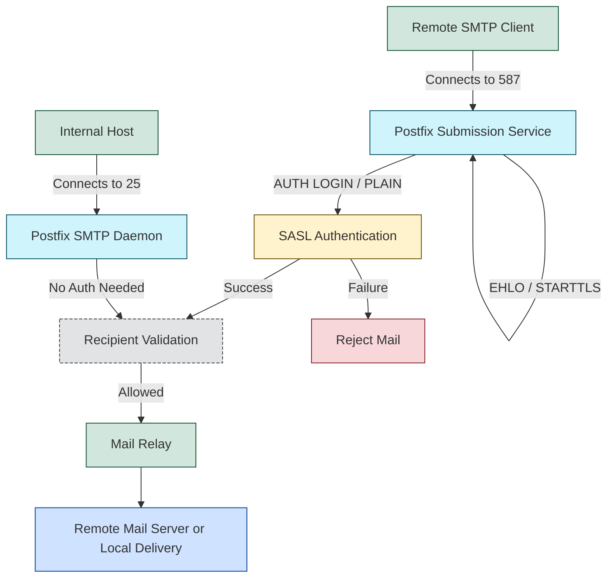

### **`main.cf` settings**

```text
smtpd_sasl_auth_enable = yes
smtpd_sasl_security_options = noanonymous
smtpd_sasl_local_domain = $myhostname
smtpd_recipient_restrictions =
    permit_sasl_authenticated,
    permit_mynetworks,
    reject_unauth_destination
```

**Summary:**

1. **`smtpd_sasl_auth_enable = yes`**

   * Enables **SMTP authentication** for clients.
   * Without this, remote clients cannot authenticate to send mail through your server.

2. **`smtpd_sasl_security_options = noanonymous`**

   * Disables anonymous authentication.
   * Only allows users with a valid username/password to authenticate.

3. **`smtpd_sasl_local_domain = $myhostname`**

   * Tells SASL which domain to consider as local for authentication purposes.
   * Typically matches the Postfix hostname.

4. **`smtpd_recipient_restrictions`**
   Controls who can send mail through your server:

   * `permit_sasl_authenticated` → Authenticated users can relay mail.
   * `permit_mynetworks` → Hosts in `mynetworks` (usually internal LAN) can relay mail without authentication.
   * `reject_unauth_destination` → Rejects any mail that is not local or from allowed sources.
   * ✅ This combination prevents your server from becoming an **open relay**.

---

### **`master.cf` settings** (submission service)

```text
submission inet n       -       n       -       -       smtpd
  -o syslog_name=postfix/submission
  -o smtpd_tls_security_level=encrypt
  -o smtpd_sasl_auth_enable=yes
  -o smtpd_recipient_restrictions=permit_sasl_authenticated,reject
```

**Summary:**

1. **`submission inet ... smtpd`**

   * Enables the **SMTP Submission port (587)** for clients to send mail securely.
   * Different from port 25, which is primarily for server-to-server mail.

2. **`syslog_name=postfix/submission`**

   * Logs for this service will appear under `postfix/submission` in syslog.

3. **`smtpd_tls_security_level=encrypt`**

   * Forces **encryption (TLS)** on the submission port.
   * Ensures passwords are not sent in cleartext.

4. **`smtpd_sasl_auth_enable=yes`**

   * Enables authentication specifically for this submission service.

5. **`smtpd_recipient_restrictions=permit_sasl_authenticated,reject`**

   * Only authenticated users can send mail through this port; everything else is rejected.
   * This is stricter than the general `main.cf` settings for security.

---

### ✅ **Overall behavior of this Postfix setup**

* Remote clients must **authenticate** to relay mail.
* Only authenticated users or trusted internal hosts can send mail.
* Submission on port 587 **requires TLS**.
* Anonymous relay and open relay are **not allowed**.
* System could integrate with **SASL (Cyrus or Dovecot)** for managing usernames and passwords.

---

