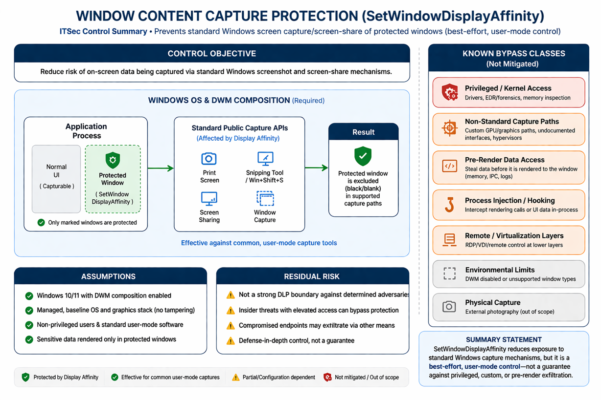

---
# **Control: Window Content Capture Protection (SetWindowDisplayAffinity)**
## **Control Objective**

Prevent or reduce the risk of sensitive on-screen content being captured via standard Windows screen capture and screen-sharing mechanisms by marking application windows as excluded from capture.

---

## **Assumptions**

* The endpoint is a managed Windows 10/11 system with **Desktop Window Manager (DWM)** composition enabled.
* The threat model focuses on **non-privileged users and standard user-mode software**.
* The control is intended to mitigate **casual or opportunistic capture**, not advanced adversaries.
* Sensitive data is rendered only within windows explicitly configured with `SetWindowDisplayAffinity`.
* The operating system and graphics stack are **unmodified and trusted**.

---

## **Known Bypass Classes**

The control does **not** provide protection against the following classes of attacks:

1. **Privileged or Kernel-Level Access**

   * Malware, EDR tools, or insiders with elevated privileges can access screen content via kernel drivers, memory inspection, or graphics stack instrumentation.

2. **Non-Standard or Unsupported Capture Paths**

   * Custom capture tools that do not rely on standard Windows APIs (e.g., alternative GPU paths, undocumented interfaces, or direct framebuffer access).

3. **Pre-Render Data Access**

   * Extraction of sensitive data **before rendering** (e.g., from application memory, IPC channels, logs, or backing data structures).

4. **Process Injection / Hooking**

   * Code injection into the target process to intercept rendering calls or UI data before it reaches the protected window.

5. **Remote Access / Virtualization Layers**

   * Remote desktop, VDI, or virtualization solutions that may capture content at a layer that does not enforce display affinity semantics.

6. **Environmental or Configuration Limitations**

   * Scenarios where DWM is disabled or not in control of composition.
   * Misapplication (e.g., child windows, unsupported window types).

7. **Out-of-Scope Physical Capture**

   * External photography or video capture (explicitly excluded from this threat model).

---

## **Residual Risk**

* The control provides **defense-in-depth** against common and low-effort capture techniques but **does not constitute a strong data loss prevention (DLP) boundary**.
* A determined adversary with sufficient privileges or tooling can bypass the control.
* Risk remains for:

  * Insider threats with elevated access
  * Compromised endpoints
  * Advanced capture tooling outside standard OS pathways

---

## **Summary Statement**

`SetWindowDisplayAffinity` is an effective mitigation against standard Windows screen capture mechanisms but should be treated as a **best-effort, user-mode protection**, not a guarantee against deliberate or advanced data exfiltration techniques.
