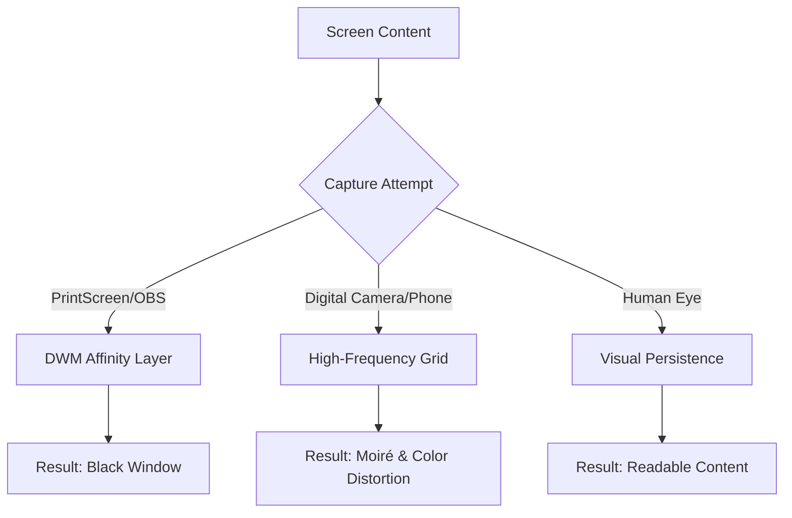

# Camera & Capture Shield (C++)

A proof-of-concept Windows application designed to prevent both **digital** (physical camera) and **analog/software** (print screen/OBS) unauthorized captures of screen content.

## 🛡️ Dual-Layer Protection

This tool employs two distinct methods to ensure content remains private:

1.  **Software Layer (`SetWindowDisplayAffinity`):** Utilizes the Windows Desktop Window Manager (DWM) to exclude the window from the frame buffer. Any software-based capture (Snipping Tool, OBS, Discord, Zoom) will see a black rectangle.
2.  **Physical Layer (Moiré Interference):** Generates a high-frequency 1-pixel vertical grid. While appearing as a neutral gray mesh to the human eye, it triggers intense **Moiré patterns** and **chromatic aliasing** on digital camera sensors (smartphones), rendering the photo/video illegible.

### Protection Workflow



---
### How the Protections Work Together

| Capture Method | Result of This Code | Technical Mechanism |
| :--- | :--- | :--- |
| **Print Screen / Snipping Tool** | **Total Blackout** | The DWM (Desktop Window Manager) excludes the window surface from the composition buffer sent to the capture API. |
| **OBS / Teams / Zoom** | **Total Blackout** | Same as above; the window appears as a black rectangle or is entirely transparent. |
| **Digital Camera (Phone)** | **Moiré / Aliasing** | The 1-pixel high-frequency lines conflict with the camera's Bayer filter, creating rainbow "oil-slick" patterns. |
| **Human Eye** | **Light Gray Mesh** | The eye averages the 1px white/1px black lines into a neutral gray flicker (depending on refresh rate). |

---

## 🚀 Cross-Compilation (Fedora to Windows)

This project is designed to be built on **Fedora Linux** using the `mingw64` toolchain.

### 1. Prerequisites
Install the MinGW-w64 compiler and the SFML development libraries:

```bash
sudo dnf install mingw64-gcc-c++ mingw64-sfml
```

### 2. Build Command
Compile the source into a Windows executable. This command links the necessary Win32 system libraries (`user32`, `dwmapi`) required for display affinity.

```bash
x86_64-w64-mingw32-g++ main.cpp -o secure_glitch.exe \
    -O3 \
    -lsfml-graphics -lsfml-window -lsfml-system \
    -luser32 -lgdi32 -lopengl32 -lwinmm -ldwmapi
```
#### Breakdown of the Flags
* **`-O3`**: High-level optimization. Since you are rendering 1-pixel lines in a loop, this ensures the CPU keeps up with high refresh rates without stuttering.
* **`-Dsfml-static`**: Defines the static macro. While Fedora's MinGW SFML package usually provides shared libraries (`.dll`), adding this ensures the compiler looks for the correct headers.
* **`-lsfml-graphics -lsfml-window -lsfml-system`**: The core SFML modules in their required linking order.
* **`-luser32`**: **Critical.** This provides the `SetWindowDisplayAffinity` function.
* **`-lgdi32 -lopengl32 -lwinmm`**: These are "transitive dependencies." SFML relies on them to talk to the Windows graphics driver and handle timing.
* **`-ldwmapi`**: Links the Desktop Window Manager API, which helps Windows coordinate the "Exclude from Capture" behavior.

`libwinpthread-1.dll`

---

## 📦 Deployment

### Deployment Checklist for Windows
Since you are cross-compiling, the `.exe` will not be standalone unless you specifically linked static versions of everything (which is complex with the default Fedora packages). You will need to copy these DLLs from your Fedora sys-root to the same folder as your `.exe` on the Windows box:

1.  **SFML DLLs:** Located in `/usr/x86_64-w64-mingw32/sys-root/mingw/bin/`
    * `libsfml-graphics-2.dll`
    * `libsfml-window-2.dll`
    * `libsfml-system-2.dll`
2.  **MinGW Runtime:** (Also in the same `bin` folder)
    * `libgcc_s_seh-1.dll`
    * `libstdc++-6.dll`
      
To run the `.exe` on a Windows machine, ensure the following DLLs (found in `/usr/x86_64-w64-mingw32/sys-root/mingw/bin/` on Fedora) are in the same directory:

* **SFML:** `libsfml-graphics-2.dll`, `libsfml-window-2.dll`, `libsfml-system-2.dll`
* **Runtime:** `libgcc_s_seh-1.dll`, `libstdc++-6.dll`, `libwinpthread-1.dll`

---

## 🛠️ Technical Details

* **Language:** C++17
* **Library:** SFML (Simple and Fast Multimedia Library)
* **Win32 API:** `SetWindowDisplayAffinity` with `WDA_EXCLUDEFROMCAPTURE` (0x11).
* **Requirements:** Windows 10 Version 2004 or newer for full exclusion support.

> [!IMPORTANT]
> This is a technical demonstration. While `WDA_EXCLUDEFROMCAPTURE` is highly effective against standard user-mode capture tools, it may be bypassed by kernel-mode drivers or specific hardware capture cards.

---
